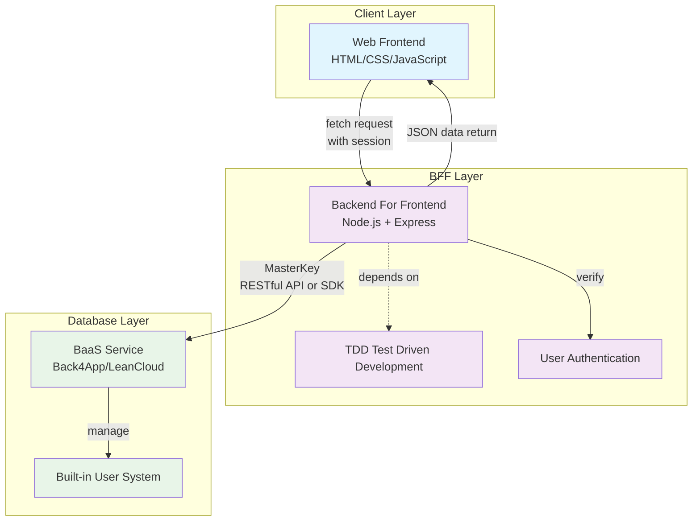

[中文](./cn.md)

People with frontend backgrounds often lack sensitivity to database and server-side security knowledge before gaining sufficient experience in server-side development. Even when they attempt it, they often create security vulnerabilities.

I have designed an independent development technical architecture suitable for frontend developers of all levels. Of course, it's not limited to independent development; strictly speaking, it's for low-cost, small-scale development.

I have simplified it and named it CBD, which is an abbreviation for Client-BFF-Database.

The Client side represents all foreseeable frontends, including but not limited to: Web, Mini Programs, APP, Desktop applications, etc.

BFF stands for Backend For Frontend, which is essentially a middleware layer used to integrate data resources and provide effective frontend distribution, avoiding separate interfaces for various frontends by converting multiple interfaces into a single interface that returns unified JSON data. It can also handle authentication, as it is a middleware layer.

Database - this is where people with frontend backgrounds really struggle, as databases alone require several books to cover thoroughly, not to mention the distinction between relational and non-relational databases, and various options like MySQL, MongoDB, each with their own syntax.

But when developing software, you basically can't escape these things, so how to design a software architecture that is low-cost, simple, fast, and highly user-friendly is very important. It not only solves problems but also solves them quickly and securely. Here is the solution.

Assuming there's a software divided into Web frontend, server-side, and database, we can treat the Web frontend, server-side, and database as Client, BFF, and Database respectively.

For technology selection, the Web frontend doesn't matter much - just HTML, CSS, JavaScript, and use fetch for network communication.

For the backend, use Node.js. Similarly, the framework doesn't matter; you can choose what you like. We'll default to using Express.

The main consideration is the database service selection, which determines all the upper-level architecture. Here we use BaaS service providers like Firebase, Supabase, Parse, etc. We'll use Back4App, a commercial service based on Parse. For domestic alternatives, there's LeanCloud. It doesn't matter which one you choose.

Note that architectural design must be simple and easy to understand. After making the above choices, you must ensure functional independence:

1. The Web frontend only handles presentation logic, achieving excellence in user interaction without processing any business logic. Here, business logic specifically refers to logic related to database operations;
2. The server-side handles all database-related business logic, including but not limited to CRUD operations and authentication;
3. The database only does one thing: store data. It doesn't handle any business logic. Be careful not to use any non-business features that come with the database, such as authentication, especially MongoDB-related secondary services that particularly like to add database authentication, such as some cloud development services.

Based on the above guidance, when we look at the specific implementation with Back4App, it's actually very simple:

1. All data is not readable or writable by default (only masterkey can read and write). This reduces dependence on database design and lowers architectural cognitive load. In short, except for your masterkey, no one can touch the data;
2. User authentication relies on Back4App's built-in user system, using sessions. Put it in the Web frontend's request headers to send to the server;
3. The server takes the user's session and masterkey to request data from Back4App's API, then returns it to the Web frontend.

The negative effect of the above: masterkey leakage, which is fatal, so sufficient security measures need to be taken. But for small-scale applications, this is not a big problem - at worst, you can reset it.

Key points:
1. masterkey security;
2. The server needs TDD (Test Driven Development) to ensure server code robustness;
3. The service provider must provide server-side SDK or RESTful API to ensure server availability.

If you develop small software this way, its efficiency and cost are very low, but its security, robustness, maintainability are very high, and its scalability is also high, because the architectural design is simple, so scalability is also high.

## CBD Architecture Diagram

### Architecture Features

1. **Three-tier Communication Flow**:
   - Client layer: Web frontend sends fetch requests with session to BFF
   - BFF layer: Receives requests, verifies session, uses MasterKey to call BaaS RESTful API
   - Database layer: BaaS service handles data storage and user management

2. **BFF Depends on TDD**:
   - BFF layer adopts Test Driven Development to ensure code robustness
   - All business logic is centralized in the BFF layer
   - Service stability is guaranteed through comprehensive test cases

3. **Security Mechanisms**:
   - Database layer is not readable or writable by default (only MasterKey can access)
   - User authentication through BaaS built-in user system
   - Session mechanism ensures user identity verification 
