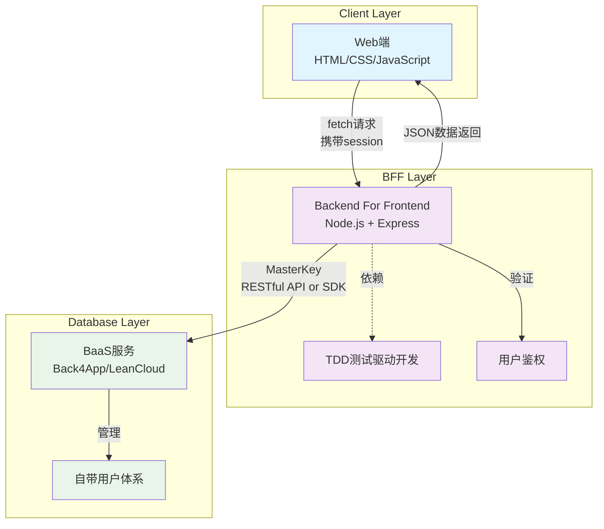

前端出身的人，在未能打到足够长时间的服务端开发前，往往对于数据库以及服务端安全相关知识并不够敏感，即使去做也会漏洞百出。

我这里设计了一种适合各种水平的前端使用的独立开发技术架构，当然不限于独立开发，严格来说，是小成本小体量的开发。

我将其精简命名为CBD，其实是Client-BFF-Database的缩写。

Client这边即表达了可预见的所有前端，包括但不限于：Web、小程序、APP、桌面端等等。

BFF是指Backend For Frontend，其本质是一种中间层，多用来整合数据资源，进行有效的前端分发，避免各种前端各自接口，将多接口转为一个接口，通过JSON统一返回。也可以做鉴权，毕竟也是中间层。

Database数据库，这个主要就是前端出身的人，真的不擅长数据库知识，毕竟光是数据库，讲几本书都不够，更何况还区分关系型、非关系型等等，还有市面上MySQL、MongoDB等，语法又是一套套的。

但是你开发一个软件，基本又逃不开这些东西，所以如何低成本、简单、快速、高亲和力的开发一款软件架构设计就很重要。它不单解决问题，还可以快速、安全的解决问题，以下就是方案说明。

假设有一款软件，分为Web端、服务端、数据库端，那么我们就可以将Web端、服务端、数据库端分别作为Client、BFF、Database。

此时我们做技术选型，Web端随便，这不重要，就HTML CSS JavaScript三套，网络通信使用fetch。

后端使用Node.js，同样的，框架不重要，你可以选择你喜欢的，我们还是默认使用Express。

主要是数据库服务的选择，这决定了我们所有上层的建筑，这里我们使用BaaS服务商，类似Firebase、Supabase、Parse等，这里我们使用基于Parse的商业化服务：Back4App，国内的话有平替->LeanCloud，选谁不重要。

注意，架构设计一定要简单，容易理解。上面这样选择后，一定要保证其功能独立性：

1. Web端只处理展示型逻辑，即用户交互方面达到极致，不处理任何业务逻辑，这里业务逻辑特指需要与数据库有关的逻辑；
2. 服务端处理全部与数据库有关的业务逻辑，包含但不限于CRUD、鉴权；
3. 数据库只做一件事，即存储数据，不处理任何业务逻辑，千万注意，不要使用任何数据库自带的非业务功能，比如鉴权等，尤其是MongoDB相关的二次服务，特别喜欢加数据库鉴权，比如一些云开发。

基于上述的指导，我们放到具体的Back4App上来看，其实就很简单：

1. 所有数据默认不可读不可写（只有masterkey可以读写），这样依赖减轻了对其数据库设计的依赖，而也降低了架构认知，总之就是，除了你masterkey，谁都不能碰数据；
2. 用户鉴权依赖Back4App提供的自带用户体系，走session即可，放到Web端的请求头带给服务端；
3. 服务端拿着用户的session和masterkey，去Back4App的API请求数据，然后返回给Web端。

上面带来的负面效果：masterkey的泄露，这个是致命的，所以需要做足够好安全措施，但这对小体量来说，问题不大，大不了重置。

注意点：

1. masterkey安全；
2. 服务端需要TDD，即测试驱动开发，这样保证服务端代码的健壮性；
3. 服务商一定要提供服务端SDK或RESTful API，这样保证服务端可用。

如果这样来开发小软件，那么其效率和成本都很低，但是其安全性、健壮性、可维护性都很高，而且其扩展性也很高，因为其架构设计简单，所以扩展性也很高。

## CBD架构图

### 架构特点说明

1. **三端通信流程**：
   - Client层：Web端通过fetch携带session向BFF发起请求
   - BFF层：接收请求，验证session，使用MasterKey调用BaaS RESTful API
   - Database层：BaaS服务处理数据存储和用户管理

2. **BFF依赖TDD**：
   - BFF层采用测试驱动开发，确保代码健壮性
   - 所有业务逻辑集中在BFF层处理
   - 通过完善的测试用例保障服务稳定性

3. **安全机制**：
   - 数据库层默认不可读写（仅MasterKey可访问）
   - 用户鉴权通过BaaS自带用户体系
   - Session机制确保用户身份验证
